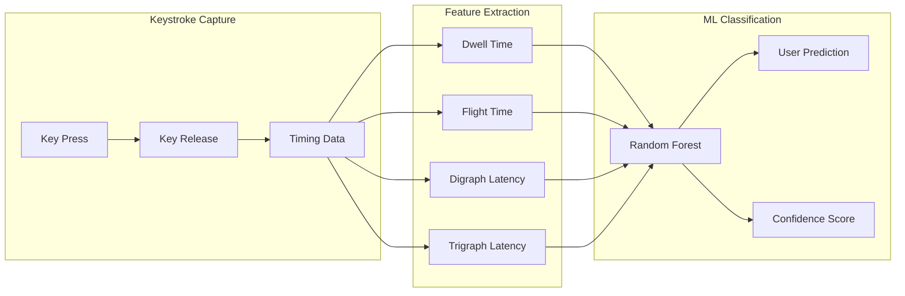

# ⌨️ Keystroke Dynamics Biometric Authentication

[](https://www.python.org/downloads/)
[](https://streamlit.io)
[](https://scikit-learn.org)
[](https://opensource.org/licenses/MIT)

A modern ML-powered biometric authentication system that identifies users based on their unique typing patterns. Your keystroke dynamics—how long you hold keys, the rhythm between keystrokes—create a behavioral biometric signature as unique as your fingerprint.


## ✨ Features

- **🔒 Behavioral Biometrics**: Authenticate users based on how they type, not what they type
- **🤖 ML-Powered**: Random Forest classifier with confidence scoring
- **📊 Real-time Analytics**: Visualize typing patterns with interactive Plotly charts
- **🎨 Modern UI**: Sleek dark-themed Streamlit interface
- **⚡ Fast Training**: Quick model training with minimal samples

## 🧠 How It Works

The system captures and analyzes three key typing characteristics:



### Keystroke Features

| Feature | Description | Example |
|---------|-------------|---------|
| **Dwell Time** | How long a key is held down | Hold time for 'e' = 85ms |
| **Flight Time** | Time between releasing one key and pressing the next | Gap between 't' and 'h' = 120ms |
| **Digraph Latency** | Time to type common two-letter sequences | 'th' takes 210ms total |
| **Trigraph Latency** | Time to type common three-letter sequences | 'the' takes 350ms total |

## 🚀 Quick Start

### Prerequisites

- Python 3.10 or higher
- pip package manager

### Installation

```bash
# Clone the repository
git clone https://github.com/yourusername/keystroke-biometrics.git
cd keystroke-biometrics

# Create virtual environment (recommended)
python -m venv venv
source venv/bin/activate  # On Windows: venv\Scripts\activate

# Install dependencies
pip install -r requirements.txt
```

### Running the Application

```bash
streamlit run app.py
```

The app will open in your browser at `http://localhost:8501`

## 📖 Usage

### 1. Register Users

1. Navigate to the **Register** page
2. Enter a unique username
3. Type 3 sample paragraphs to train your profile
4. System learns your unique typing patterns

### 2. Authenticate

1. Navigate to the **Authenticate** page
2. Type the displayed paragraph naturally
3. Click "Authenticate" to identify yourself
4. View confidence score and probability distribution

### 3. Analytics

1. Navigate to the **Analytics** page
2. Select a user to view their typing profile
3. Explore dwell times, digraph patterns, and feature importance

## 🏗️ Project Structure

```
keystroke-biometrics/
├── app.py                 # Streamlit main application
├── src/
│   ├── __init__.py
│   ├── capture.py         # Keystroke timing capture
│   ├── features.py        # Feature extraction engine
│   ├── model.py           # ML model (Random Forest)
│   └── utils.py           # Helper functions
├── data/
│   └── users.json         # User keystroke profiles
├── models/
│   └── keystroke_model.joblib  # Trained model (generated)
├── requirements.txt
└── README.md
```

## 🔬 Technical Details

### Feature Vector (28 dimensions)

| Category | Features | Count |
|----------|----------|-------|
| Dwell Times | e, a, r, i, o, t, n, s, h, l, d, g, space | 13 |
| Digraph Latencies | in, th, ti, on, an, he, al, er, es | 9 |
| Trigraph Latencies | the, and, are, ion, ing | 5 |
| Typing Speed | chars/second | 1 |

### Machine Learning Pipeline

```python
# Feature scaling for normalization
scaler = StandardScaler()
X_scaled = scaler.fit_transform(X)

# Random Forest with balanced class weights
classifier = RandomForestClassifier(
    n_estimators=100,
    max_depth=10,
    class_weight='balanced',
    random_state=42
)
```

## 📊 Performance

| Metric | Value |
|--------|-------|
| Cross-validation Accuracy | ~85-95%* |
| Minimum Users | 2 |
| Samples per User | 3 recommended |
| Feature Dimensions | 28 |

*Accuracy depends on number of users and sample quality

## 🛠️ Development

### Running Tests

```bash
python -m pytest tests/
```

### Adding New Features

1. Add feature extraction in `src/features.py`
2. Update `get_feature_names()` and `to_vector()` methods
3. Retrain models with new feature set

## 📚 References

- [Keystroke Dynamics - Wikipedia](https://en.wikipedia.org/wiki/Keystroke_dynamics)
- [Biometric Authentication via Keystroke Dynamics](https://www.cs.cmu.edu/~keystroke/)
- [scikit-learn Random Forest](https://scikit-learn.org/stable/modules/ensemble.html#random-forests)

## 📝 License

This project is licensed under the MIT License - see the [LICENSE](LICENSE) file for details.

## 🤝 Contributing

Contributions are welcome! Please feel free to submit a Pull Request.

1. Fork the repository
2. Create your feature branch (`git checkout -b feature/AmazingFeature`)
3. Commit your changes (`git commit -m 'Add some AmazingFeature'`)
4. Push to the branch (`git push origin feature/AmazingFeature`)
5. Open a Pull Request

## 👤 Author

**Your Name**

- GitHub: [@yourusername](https://github.com/yourusername)
- LinkedIn: [Your LinkedIn](https://linkedin.com/in/yourprofile)

---

<p align="center">
  Made with ❤️ and ⌨️
</p>

